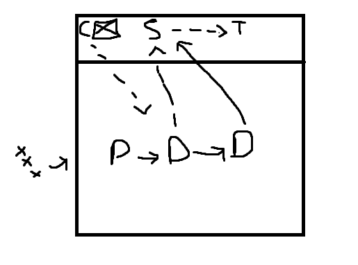
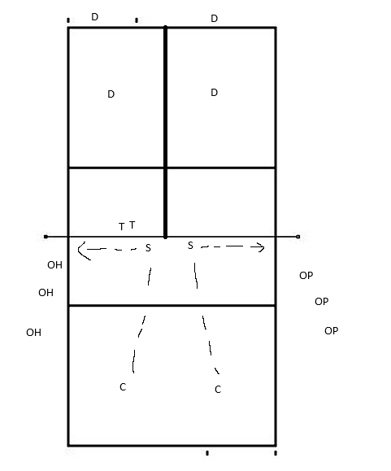

# Focus
Teaching a defensive system

Bit of a slower session as we go through defensive systems (just high level here)

When looking at the system for back court

# Backcourt
- Perimeter Defence
  - Cover the perimeter
  - Con: Weak on line tips
  - Blockers are vital for backcourt defence
- Rotation Defence
  - Right back defends tips
  - Rotation round on defence
  - Weak against cut shots
- Base Defence
  - To handle setters and be ready defensively

- Blocking System
  - Changing systems based on rotation (I.E short setter)

# Warmup
-  Pepper variations
   - Normal

## Dig around the world
- Base defence position, without a block

## Dig a dozen
- 3 hitters on the wing 
- 2 defenders 
- 2 targets
- 2 feeders

# Gameplay
First to 25

