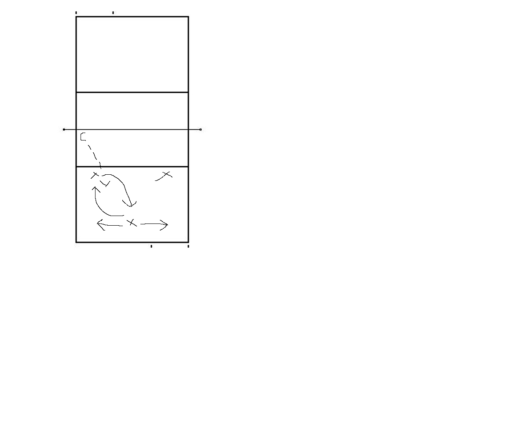

# Focus
Getting low in posture, shuffling and covering the court, see the defence move in rally, we're after watching the ball coming over and getting into defensive stances (ideally 100%) of the time

# Warmup
- 1 vs 1 warmup 3 touch pepper
  - Swapping players out from ordinary peppering, or stretching, creating pace and engagement
- A cooperative same side court warmup

# Defensive Shuffle
- Maintaining a low posture
- Moving around the court
- Covering as much of the court

This is where players at MB (6), will rotate to cover in for 5 or 1 and 1 or 5 will shift back to cover for 6

The goal is to create more agency on court

# Wash Drill
(6 vs 4)
1. Serve and SR on 6 side
2. Coach puts a ball into gaps on court 
3. To call offence on 6 side, I.E free ball, dump, middle, wing attack

