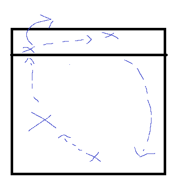

---
layout: post
title: "Cross court hits"
date: "2024-01-09"
description: Looking at the attack
---

1 week until GP

# Focus
Cross Court Hits

## Warm up
- Pepper, 2 people swap 
- 2 hand high ball toss
  - Middle of the ball

** think Zeus, elbow, swing **

### Co operative cross court (drill of 10)
- 4 players on court, rotate on at middle back (6)
- Can only be hit at positions 4, 5, 6
- 4 hitter to swing cross (standing)
- Rotate Through
- Add jump in later on

3m set

### Blocking drill
- 2 benches alternating hits
- hitting into the blockers at a cross
- Covering through each position
