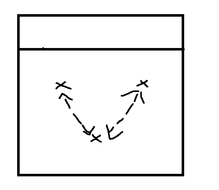

# Focus
Getting used to chasing the ball as a team

## Warmup
- Pepper Variation
  - Normal
  - One arm bumps
  - Under their noses

# 3* side to side
- 15 reps each, catch passes counts as one rep

# Chase the ball
- Start with noodles in 2's
- Add in a free ball in
- Add 2 hitters in
- All practice on noodle

# Semi Circle Passing
- Semi circle passing, shuffle step (cones in a semi circle)
- Stay low

# Gameplay on Serve
- Points to 25
