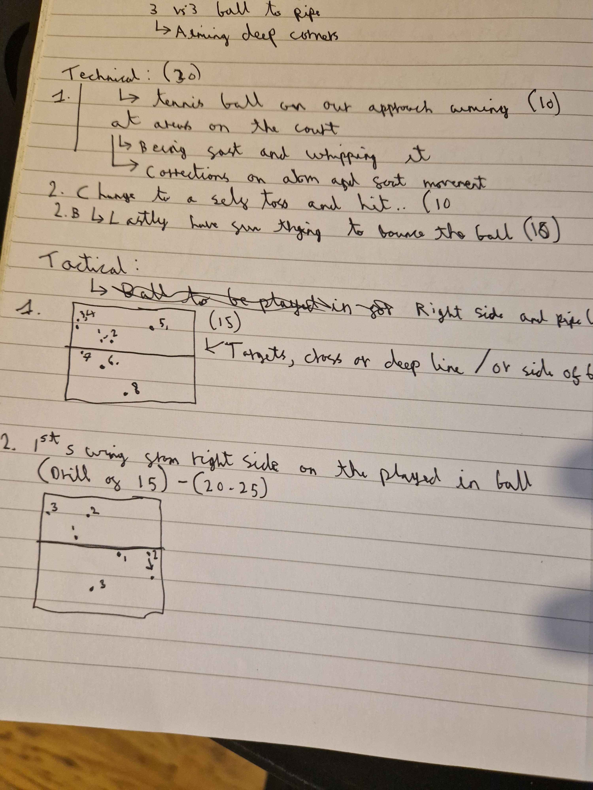

---
layout: post
title: "Right side and 6 defence"
date: "2025-04-01"
description: Looking at using our opposite / right side hitter and how we defend as 6
---

# Warmup (20 mins)
Ball control drill 30 reps before moving onto the next one and if the ball drops restart from the start 
- 4 minutes to complete all of them
   - Starting with volley and only 
   - Forearm only
   - Jump set
   - 2 contact and forearms pass

- 3 vs 3 Ball to pipe
  - Aiming deep corners

# Technical (30 mins)
- Tennis ball, on our approach aiming at areas on the court
  - Being fast and whipping the ball
  - Corrections on arm and feet movement
- Change to a self toss and a hit (with a volleyball)
  - Lastly have fun trying to bounce the ball then doing your attack approach

# Tactical
  - Looking at where the attackers can hit for the right side (opposite) or the pipe

# Game
First to 25

