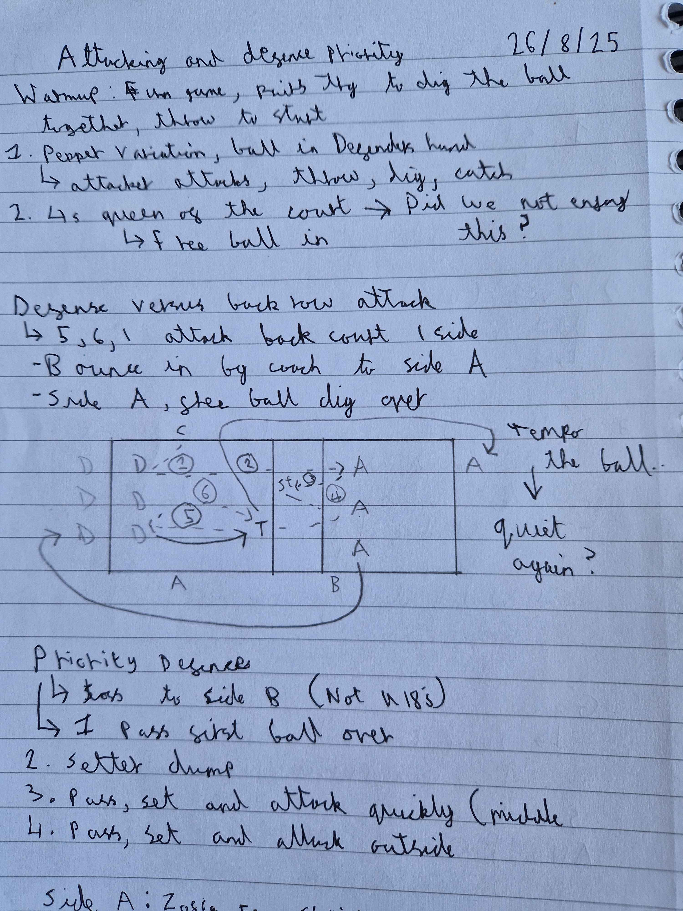

# What we have
- 4U16s, 8U18s
- 1 court and 20+ balls

# Warmup (20mins)
- In pairs, trying to dig the ball together, with a ball being thrown over the net from opposition, then break and play the rally out
- Pepper variation, ball in defenders hands
  - Attacker attacks, ball is thrown from defender to then dig the attacked ball and try to catch the thrown ball
- 4s Queen of the court
  - Free ball in

  

# Priority Defence
- Toss to side B
  - 1 pass first ball over
  - 2 Setter dump
  - 3 pass, set and a quick attack (middle)
  - 4 pass, set and attack outside

I had selected the players on which sides for this drill

# Game
First to 25

Looking at how the defensive priority was implemented, changing the attacks that were happening