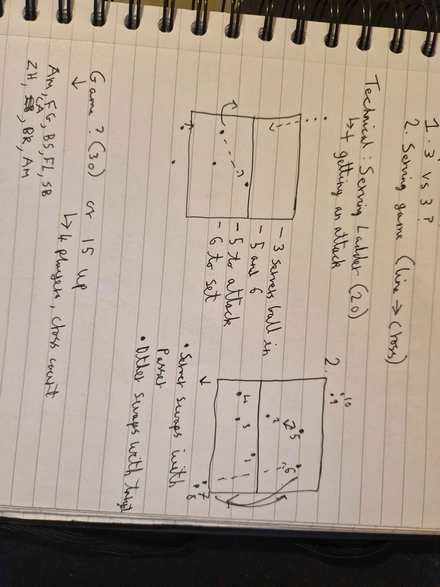

---
layout: post
title: "Float service"
date: "2025-03-27"
description: Going over float service (again)
---

# Warmup (20 mins)
- Pepper
- 3 vs 3
- Serving game (going line or cross)

# Technical
- Serving Ladder
  - Plus getting an attack in

  3 servs in and ball played for an attack (between 2 players on a half court)

  Server swaps with passer, other swaps with target
(Did have diagrams that I cannot upload)

 

# Game
First to 25
