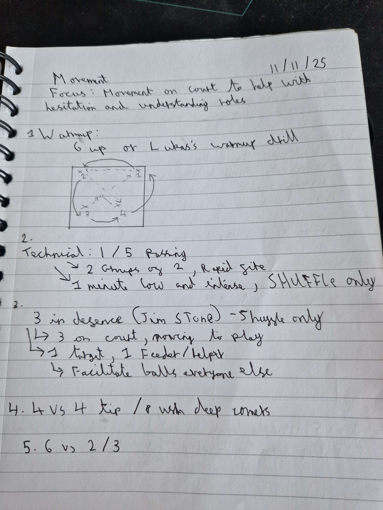

We had a difficult tournament before and so switched focus to movement on court to keep things a bit more fresh, whilst still working on our serving and SR programme (for 4 / 6 weeks)

# Focus;
Movement on court to help with hesitation and understanding roles

# Resources
- 1 hour 30 minutes
- 12 players
- 6+ balls, 1 court

# Warmup
This is a variation of 6 up and I like to call it the Lukas drill (credit to Lukas)
- Setter at 2, pushes to 4, 4 to attack to 1 and pass to the middle for 5 to pass, rotating after your action (all on one side of the court)

(please Youtube video linked for this;)

![Watch the video]image.jpg(https://www.youtube.com/watch?v=Sw9Frzc7PpI)
(specifically;)

1 / 5 passing
<iframe width="560" height="315" src="https://www.youtube.com/embed/Sw9Frzc7PpI?si=BpVcXxB6HYFA4UMX&amp;start=114" title="YouTube video player" frameborder="0" allow="accelerometer; autoplay; clipboard-write; encrypted-media; gyroscope; picture-in-picture; web-share" referrerpolicy="strict-origin-when-cross-origin" allowfullscreen></iframe>
# Technical 1 / 5 passing (Jim stone defensive fundamentals))
- 2 groups of 2, rapid fire
- 1 minute low and intense, shuffle only

<iframe width="560" height="315" src="https://www.youtube.com/embed/Sw9Frzc7PpI?si=7lF-Q52PAoFo6k1o&amp;start=217" title="YouTube video player" frameborder="0" allow="accelerometer; autoplay; clipboard-write; encrypted-media; gyroscope; picture-in-picture; web-share" referrerpolicy="strict-origin-when-cross-origin" allowfullscreen></iframe>
# 3 in defence (Jim stone defensive fundamentals)
- 3 on court moving to play
- 1 target, 1 feeder to help
  - everyone to facilitate

# 4 vs 4 tip / push deep corners
a 4 vs 4 game around playing tip / deep corners and seeing if we are watching and picking up those plays with movement

# Game 
First to 25

