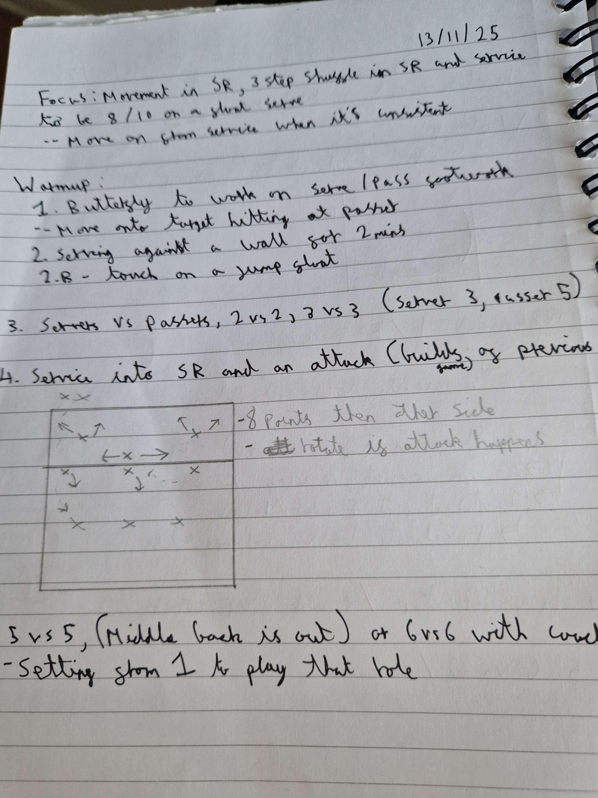

# Focus;
Movement in SR, 3 step shuffle in SR and service to be 8 / 10 in on a float service

# Resources
- 1 hour 30 minutes
- 10 players
- 6+ balls, 1 court

# Warmup
Butterfly to work on serve / pass footwork
  - Move onto target hitting at passer (after the receive pass)
Serving against a wall for 2 mins, working on contact
  - Touch on a jump float (using traditional jump float footwork, I.E Left step, toss)

# Servers vs passers
- 2 vs 2 and 3 vs  (servers to get 3 points before passers get 5)

## Service into SR and an attack (building off of servers vs passers)
- 8 points then other side, rotate if attack happens

# 5 vs 5
- Middle back is out
- Setting from 1 rotate around

# Game 
First to 25

