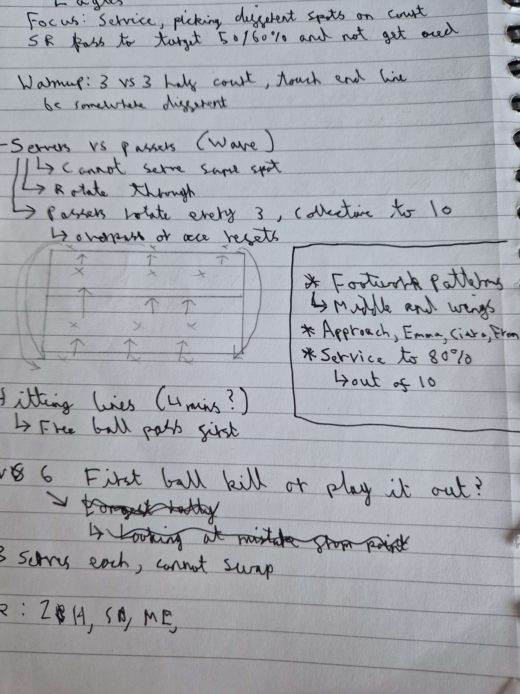

# Focus;
Service, picking different spots on court to serve, SR pass to target 50/60% and not get aced

# Resources
- 1 hour 30 minutes
- 12 players
- 6+ balls, 1 court

# Warmup
6 vs 6 within 3m line, touch end line before coming back, have to go somewhere different

## Servers vs passers (Wave)
- 3 servers vs 3 passers, looking at technique and service
- Cannot serve to the same spot
  - Passers rotate every 3 serves (staying in receive) collective to 10 good passes

# Hitting lines 
- 2 feeders, 2 setters, 2 passers, 3 hitters
  - 3 minute cycles
- Starting on the net, getting off the net
- L, R, L footwork

# One ball kill
Playing a rally out where the first attack ends the rally, if defence get a touch they win the point and trying to target deep serves into the court
- SR and an attack on these deeper serves
- 3 Serves each before rotate

# Game 
First to 25

