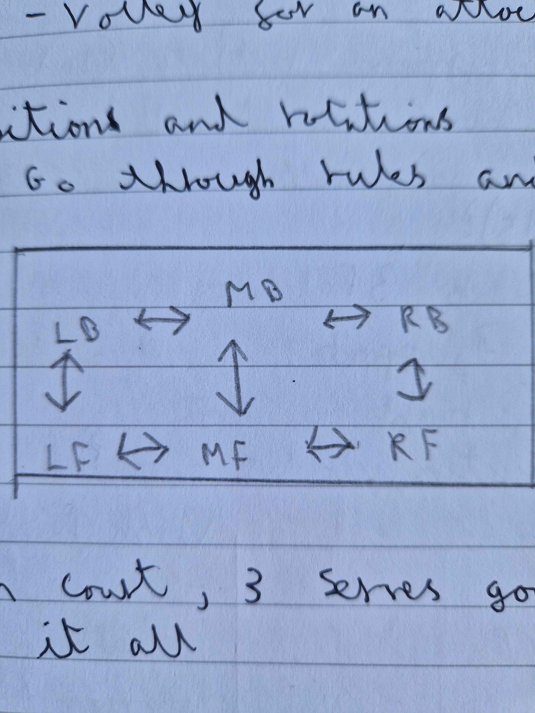

---
layout: post
title: "Poisitions on serve receive"
date: "2025-09-02"
description: Looking at how positions work on court and how the rules work
---

# Season setup
Had an open conversation with parents setting up the structure for the season and what we were looking to do here.

# What we have
- 13U18s
- 1 court and 20+ balls

# Warmup (20mins)
- 6 on court (2 touches)
  - back court defensive pass 
  - into a volley for an attack
- Add in a 2nd ball in play

# Positions and rotations
  - Go through the rules and serve receive, see diagram for the basics of how we went through the rules on this

  

On Court we then did 3 serves going through a 5:1 system and how it works with these rules

# Randomising the setter
- We elected 2 setters for the team, and then said random positions on court I.E setter at 2, setter at 4
- The team had to then workout the rotation off of this having 15 seconds before the point was played

# Game
First to 25
