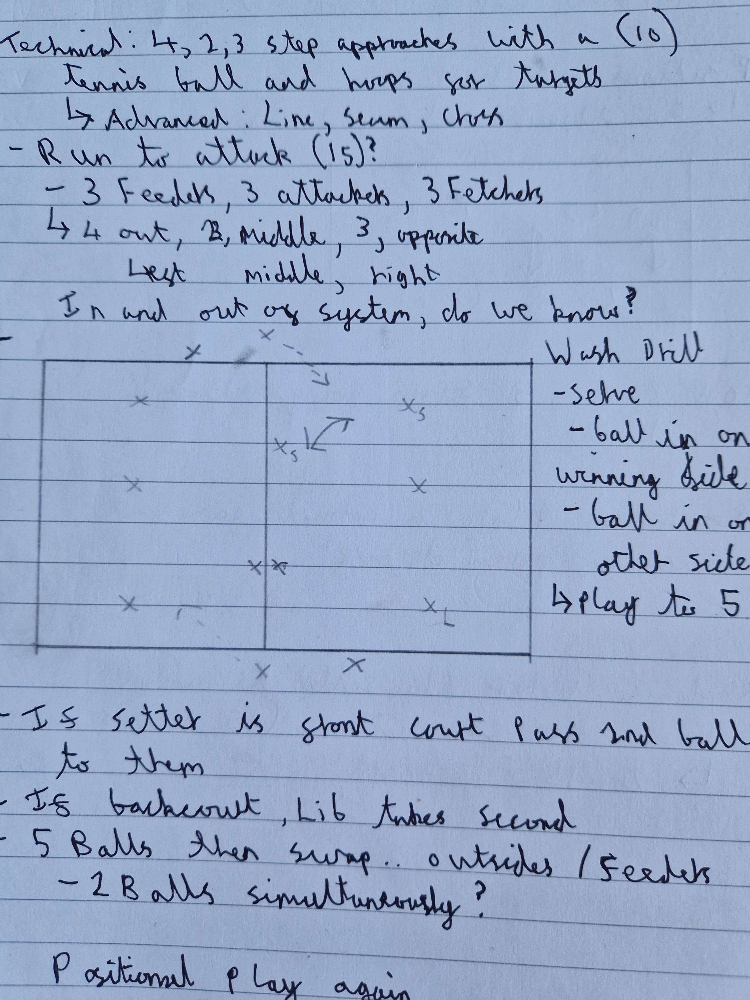

# Warmup 
- Ball control drill 30 reps before moving onto the next one and if the ball drops restart from the start 
- 4 minutes to complete all of them
   - Starting with volley and only 
   - Forearm only
   - Jump set
   - 2 contact and forearms pass
- Just working on approach, 3 steps away from net and 3 towards the net (looking at how we plant our feet and use them)

# Technical
- 4, 3, 2 step approaches with a tennis ball, hula hoops for targets (advanced; line, seam, cross)
- Run to attack
  - 3 feeders, 3 attackers, 3 fetchers
  - 4 out, 2 middle, 3 opposite
  left, middle, right

  

  Wash drill;
  - Serve
  - Ball in on winning side
  - ball in on other side
  - Play to 5

If setter is front court pass 2nd ball to them, if back court, live takes the 2nd ball
- 5 balls then swap, outsides /feeders
  - Look at trying 2 balls simultaneously

# Randomising the setter
- We elected 2 setters for the team, and then said random positions on court I.E setter at 2, setter at 4
- The team had to then workout the rotation off of this having 15 seconds before the point was played

# Game
First to 25
