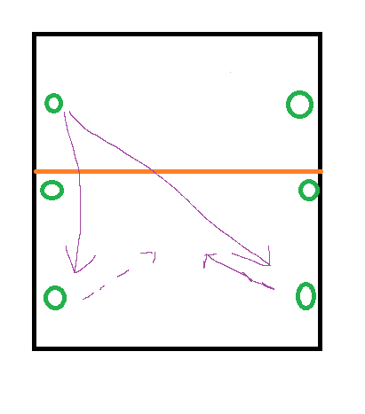

# Ball control to the wings for an attack

# resources
- 10+ players
- 6+ balls
- 1 Court
- 1hour 30 mins

# Focus
Looking at ball control to enable an attack from most places on the court, trying to create an attackable ball with a 50% success rate

# Warmup - 3 person pepper 
1 setter, 2 players on other sides of the net 

Serving on 1 side and receiving on the other, receiver goes to be the setter, setter goes to be the server, play the rally out with the setter going under the net

It's a 1 vs 1 with a setter, start with a dig to setter and then an attack front court, 

# Activity 1 - Ball control from endline to wing
2 players on other side of net with a ball, coordinate who plays the next attack

2 attackers, ready to hit and getting ready off of the net
2 defenders, ready to defend both line or cross (at 1 and 5)

Creating our defence into an attacking opportunity (1st or 2nd touch), attacker rotates when they hit in

# Activity 2 - 4 vs 4
- 2 back and 2 front

Live serve is in
And then a free ball

We rotate when an attack happens front court

Rotating through and around

# Activity 3 - Playing a ball to yourself and then to the attack
5 vs 5 (2 front, 3 back)

- Live serve
First pass is to yourself and then out to the wing

# Game
Looking at creating as many front court attacking opportunities as we can with control